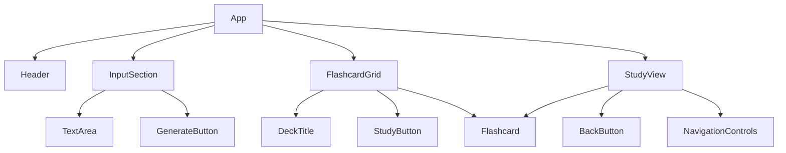

# QuizGenius Specification

## 1. Database Schema (Supabase)

We will use PostgreSQL (via Supabase) with two main tables: `decks` and `flashcards`.

### Table: `decks`
Stores the collection of flashcards generated from a single source.

| Column | Type | Constraints | Description |
| :--- | :--- | :--- | :--- |
| `id` | `uuid` | `PK`, `DEFAULT gen_random_uuid()` | Unique identifier for the deck. |
| `created_at` | `timestamptz` | `DEFAULT now()` | Timestamp of creation. |
| `title` | `text` | `NOT NULL` | Title of the deck (can be auto-generated or user-provided). |
| `source_text` | `text` | `NULLABLE` | Original text used to generate the deck (for reference). |

### Table: `flashcards`
Stores individual flashcards belonging to a deck.

| Column | Type | Constraints | Description |
| :--- | :--- | :--- | :--- |
| `id` | `uuid` | `PK`, `DEFAULT gen_random_uuid()` | Unique identifier for the flashcard. |
| `deck_id` | `uuid` | `FK -> decks.id`, `ON DELETE CASCADE` | Link to the parent deck. |
| `front` | `text` | `NOT NULL` | Content for the front of the card (Question/Term). |
| `back` | `text` | `NOT NULL` | Content for the back of the card (Answer/Definition). |
| `difficulty` | `text` | `NOT NULL` | Difficulty level (e.g., 'Easy', 'Medium', 'Hard'). |
| `created_at` | `timestamptz` | `DEFAULT now()` | Timestamp of creation. |

---

## 2. AI JSON Interface (Google Gemini)

We will use Google Gemini to generate flashcards. The prompt must enforce a strict JSON response to ensure reliable parsing.

### Request Prompt Strategy
The system prompt will instruct Gemini to act as a "Flashcard Generator" and output **only** valid JSON.

### JSON Schema
```json
{
  "type": "object",
  "properties": {
    "title": {
      "type": "string",
      "description": "A short, descriptive title for the deck based on the content."
    },
    "flashcards": {
      "type": "array",
      "items": {
        "type": "object",
        "properties": {
          "front": {
            "type": "string",
            "description": "The question or term."
          },
          "back": {
            "type": "string",
            "description": "The answer or definition."
          },
          "difficulty": {
            "type": "string",
            "enum": ["Easy", "Medium", "Hard"],
            "description": "The estimated difficulty of the question."
          }
        },
        "required": ["front", "back", "difficulty"]
      }
    }
  },
  "required": ["title", "flashcards"]
}
```

### Example Output
```json
{
  "title": "Photosynthesis Basics",
  "flashcards": [
    {
      "front": "What is the primary pigment used in photosynthesis?",
      "back": "Chlorophyll",
      "difficulty": "Easy"
    },
    {
      "front": "What are the two main stages of photosynthesis?",
      "back": "Light-dependent reactions and the Calvin cycle",
      "difficulty": "Medium"
    }
  ]
}
```

---

## 3. Component Hierarchy (React)

The application will follow a clean component structure.

### `App` (Main Container)
- **State**:
  - `currentDeck` (Object | null): The currently displayed deck.
  - `isLoading` (Boolean): Loading state during AI generation.
  - `viewMode` (Enum): 'grid' | 'study'. Defaults to 'grid'.
- **Responsibility**: Manages global layout, state orchestration, and view switching.

#### Children:
1.  **`Header`**
    - Displays the logo and app title ("QuizGenius").
    - Optional: User login status (if auth is added).

2.  **`InputSection`**
# QuizGenius Specification

## 1. Database Schema (Supabase)

We will use PostgreSQL (via Supabase) with two main tables: `decks` and `flashcards`.

### Table: `decks`
Stores the collection of flashcards generated from a single source.

| Column | Type | Constraints | Description |
| :--- | :--- | :--- | :--- |
| `id` | `uuid` | `PK`, `DEFAULT gen_random_uuid()` | Unique identifier for the deck. |
| `created_at` | `timestamptz` | `DEFAULT now()` | Timestamp of creation. |
| `title` | `text` | `NOT NULL` | Title of the deck (can be auto-generated or user-provided). |
| `source_text` | `text` | `NULLABLE` | Original text used to generate the deck (for reference). |

### Table: `flashcards`
Stores individual flashcards belonging to a deck.

| Column | Type | Constraints | Description |
| :--- | :--- | :--- | :--- |
| `id` | `uuid` | `PK`, `DEFAULT gen_random_uuid()` | Unique identifier for the flashcard. |
| `deck_id` | `uuid` | `FK -> decks.id`, `ON DELETE CASCADE` | Link to the parent deck. |
| `front` | `text` | `NOT NULL` | Content for the front of the card (Question/Term). |
| `back` | `text` | `NOT NULL` | Content for the back of the card (Answer/Definition). |
| `difficulty` | `text` | `NOT NULL` | Difficulty level (e.g., 'Easy', 'Medium', 'Hard'). |
| `created_at` | `timestamptz` | `DEFAULT now()` | Timestamp of creation. |

---

## 2. AI JSON Interface (Google Gemini)

We will use Google Gemini to generate flashcards. The prompt must enforce a strict JSON response to ensure reliable parsing.

### Request Prompt Strategy
The system prompt will instruct Gemini to act as a "Flashcard Generator" and output **only** valid JSON.

### JSON Schema
```json
{
  "type": "object",
  "properties": {
    "title": {
      "type": "string",
      "description": "A short, descriptive title for the deck based on the content."
    },
    "flashcards": {
      "type": "array",
      "items": {
        "type": "object",
        "properties": {
          "front": {
            "type": "string",
            "description": "The question or term."
          },
          "back": {
            "type": "string",
            "description": "The answer or definition."
          },
          "difficulty": {
            "type": "string",
            "enum": ["Easy", "Medium", "Hard"],
            "description": "The estimated difficulty of the question."
          }
        },
        "required": ["front", "back", "difficulty"]
      }
    }
  },
  "required": ["title", "flashcards"]
}
```

### Example Output
```json
{
  "title": "Photosynthesis Basics",
  "flashcards": [
    {
      "front": "What is the primary pigment used in photosynthesis?",
      "back": "Chlorophyll",
      "difficulty": "Easy"
    },
    {
      "front": "What are the two main stages of photosynthesis?",
      "back": "Light-dependent reactions and the Calvin cycle",
      "difficulty": "Medium"
    }
  ]
}
```

---

## 3. Component Hierarchy (React)

The application will follow a clean component structure.

### `App` (Main Container)
- **State**:
  - `currentDeck` (Object | null): The currently displayed deck.
  - `isLoading` (Boolean): Loading state during AI generation.
  - `viewMode` (Enum): 'grid' | 'study'. Defaults to 'grid'.
- **Responsibility**: Manages global layout, state orchestration, and view switching.

#### Children:
1.  **`Header`**
    - Displays the logo and app title ("QuizGenius").
    - Optional: User login status (if auth is added).

2.  **`InputSection`**
    - **Props**: `onGenerate(text)`
    - **Components**:
        - `TextArea`: For user to paste text.
        - `GenerateButton`: Triggers the API call.
    - **Behavior**: Calls `onGenerate` when clicked. Shows loading spinner if `isLoading` is true.

3.  **`FlashcardGrid`** (Visible when `viewMode` === 'grid')
    - **Props**: `deck` (Object), `onStudyClick` (Function)
    - **Responsibility**: Renders the list of flashcards if a deck exists.
    - **Components**:
        - **`DeckTitle`**: Displays `deck.title`.
        - **`StudyButton`**: Switches `viewMode` to 'study'.
        - **`Flashcard`** (Repeated)
            - **Props**: `front`, `back`, `difficulty`
            - **State**: `isFlipped` (Boolean)
            - **Behavior**: Toggles between front and back on click.
            - **Styling**: Card style with flip animation. Shows difficulty badge.

5.  **`StudyView`** (Visible when `viewMode` === 'study')
    - **Props**: `deck` (Object), `onBack` (Function)
    - **Responsibility**: Shows one flashcard at a time with navigation.
    - **State**: `currentIndex` (Number)
    - **Components**:
        - **`BackButton`**: Switches `viewMode` back to 'grid'.
        - **`Flashcard`**: The current card (reused component).
        - **`NavigationControls`**: Previous / Next buttons.
        - **`ProgressBar`**: Shows "Card X of Y".

6.  **`Footer`**
    - Copyright and links.

### Visual Component Tree

